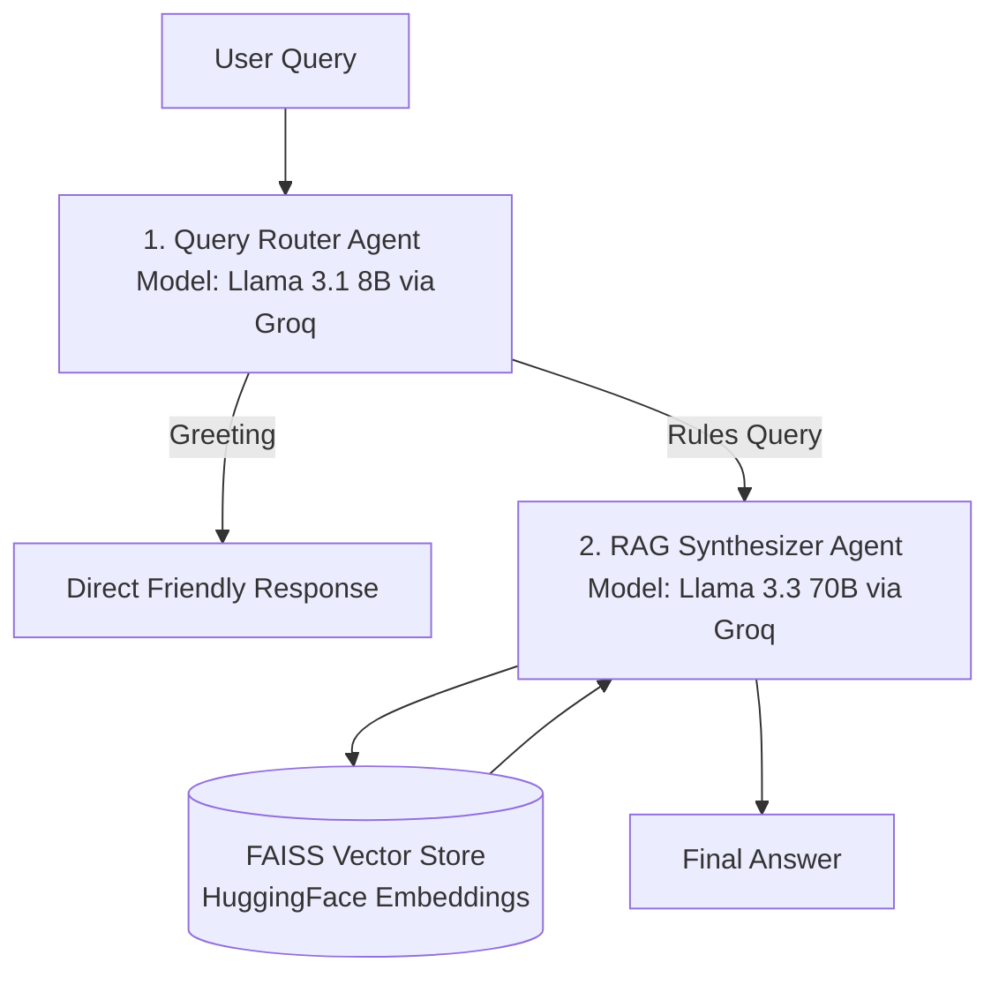

# 🎓 Horizon Campus - Student Rules & Regulations Assistant

An Agentic Multi-Agent AI system designed to assist university students by retrieving accurate information from the official Horizon Campus Student Handbook.

🌐 **Live Streamlit App:** [https://uni-student-rules-assistant-mubkwp3qupmez3qqt5okar.streamlit.app/](https://uni-student-rules-assistant-mubkwp3qupmez3qqt5okar.streamlit.app/)

---

## 🏗️ System Architecture & Workflow

The system utilizes an **Agentic RAG Design Pattern** with explicit agent-to-agent communication, intent routing, and self-critique mechanisms.


---

## 🎯 Agentic Design Patterns Used

1. **Router Pattern:** `route_query()` routes incoming user prompts into distinct intent workflows (`GREETING` vs `RULES_QUERY`) to optimize latency and token costs.
2. **Tool-Use Pattern:** The RAG Synthesizer agent interfaces dynamically with the FAISS vector store index to retrieve domain-specific context from `data/STUDENT HANDBOOK.txt`.
3. **Reflection / Self-Critique Pattern:** The synthesis agent prompt incorporates strict verification constraints to prevent hallucinations when context is missing.

---

## 🤖 Model Selection Comparison Table

| Sub-task | Model Selected | Provider | Justification (Latency, Cost, Reasoning) |
| :--- | :--- | :--- | :--- |
| **Intent Routing** | `llama-3.1-8b-instant` | Groq | **Ultra-low latency (~0.1s)**, extremely cheap/free tier usage, highly efficient for binary classification tasks. |
| **RAG Synthesis** | `llama-3.3-70b-versatile` | Groq | **Superior reasoning quality**, handles complex context synthesis reliably, fast execution speed via Groq LPUs. |

---

## 📚 RAG Pipeline Details & Evaluation

* **Corpus:** Horizon Campus Student Handbook (`.txt`)
* **Chunking Strategy:** `RecursiveCharacterTextSplitter` (Chunk Size: 1000, Overlap: 200)
* **Embedding Model:** `sentence-transformers/all-MiniLM-L6-v2` (Local HuggingFace embeddings)
* **Vector Store:** FAISS (Facebook AI Similarity Search)

### 📊 Retrieval Evaluation (5 Sample Test Queries)

| # | Test Query | Retrieved Relevant Context? | Result |
|---|---|---|---|
| 1 | What is the minimum attendance requirement? | Yes (Section on examination eligibility) | ✅ Relevant |
| 2 | What is the policy on academic integrity? | Yes (Section on misconduct & penalties) | ✅ Relevant |
| 3 | How can I request a resit exam? | Yes (Section on grading & re-examinations) | ✅ Relevant |
| 4 | What is the campus dress code policy? | Yes (Section on student conduct guidelines) | ✅ Relevant |
| 5 | Can I park my flight in the cafeteria? | No (Correctly states information is not available) | ✅ Passed (No Hallucination) |

---

## 💻 Local Setup Instructions

1. **Clone Repository:**
   ```bash
   git clone [https://github.com/lakshikamalmi53-alt/uni-student-rules-assistant.git](https://github.com/lakshikamalmi53-alt/uni-student-rules-assistant.git)
   cd uni-student-rules-assistants
