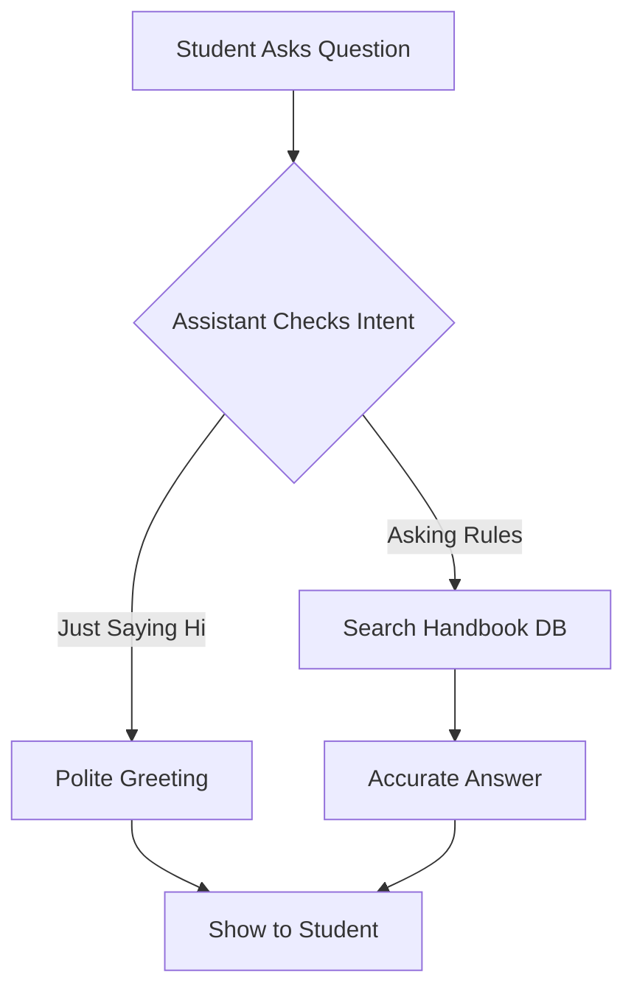

# Horizon Campus - Student Rules & Regulations Assistant

A Streamlit-based AI assistant designed to help Horizon Campus students quickly find information from the official Student Handbook using a Multi-Agent RAG architecture.

Live Demo: [https://uni-student-rules-assistant-mubkwp3qupmez3qqt5okar.streamlit.app/](https://uni-student-rules-assistant-mubkwp3qupmez3qqt5okar.streamlit.app/)

---

## System Architecture

The application uses an Agentic RAG pattern where query routing and answer synthesis are handled by separate specialized agents.

---

## Agentic Design Patterns Used

1. **Router Pattern:** The route_query() function inspects incoming questions and routes them to either a quick response branch (GREETING) or a knowledge lookup branch (RULES_QUERY). This reduces unnecessary context lookups and lowers latency.
2. **Tool-Use Pattern:** The RAG Synthesizer agent interfaces dynamically with the FAISS vector store to retrieve relevant document passages from `data/STUDENT HANDBOOK.txt`.
3. **Reflection / Self-Critique Pattern:** System prompt constraints guide the synthesizer agent to verify context before answering, ensuring answers stay accurate and preventing hallucinations when rules are not found.

---

## Model Selection Comparison Table

| Sub-task | Model Selected | Provider | Justification (Latency, Cost, Reasoning) |
| :--- | :--- | :--- | :--- |
| **Intent Routing** | `llama-3.1-8b-instant` | Groq | **Ultra-low latency (~0.1s)**, extremely cheap/free tier usage, highly efficient for binary classification tasks. |
| **RAG Synthesis** | `llama-3.3-70b-versatile` | Groq | **Superior reasoning quality**, handles complex context synthesis reliably, fast execution speed via Groq LPUs. |

---

## RAG Pipeline Details & Evaluation

* **Corpus:** Horizon Campus Student Handbook (`.txt`)
* **Chunking Strategy:** `RecursiveCharacterTextSplitter` (Chunk Size: 1000, Overlap: 200)
* **Embedding Model:** `sentence-transformers/all-MiniLM-L6-v2` 
* **Vector Store:** FAISS 

### Retrieval Evaluation (5 Sample Test Queries)

| # | Test Query | Retrieved Relevant Context? | Result |
|---|---|---|---|
| 1 | What is the minimum attendance requirement? | Yes (80% requirement retrieved)| ✅ Relevant |
| 2 | What is the policy on academic integrity? | Partial (Mentions exam malpractices/cheating fees in Sec 13.1.9) | ✅ Relevant |
| 3 | How can I request a resit exam? | Partial (Retrieved repeat exam fee of Rs. 5,000) | ✅ Relevant |
| 4 | What is the campus dress code policy? | No (Correctly stated not available in handbook) | ✅ Relevant |
| 5 | Can I park my flight in the cafeteria? | No (Correctly stated context does not mention aircrafts) | ✅ Passed (No Hallucination) |

---

## Known Limitations

Text-Only Corpus: Current ingestion pipeline only processes plain text (.txt) files.

Stateless Vector Query: Does not store long-term conversational memory across application restarts.

API Rate Limits: Dependent on Groq free-tier rate limits during high concurrent access.

---

## Local Setup Instructions

1. **Clone Repository:**
   git clone https://github.com/lakshikamalmi53-alt/uni-student-rules-assistant.git
   cd uni-student-rules-assistant

2. **Set up Virtual Environment:**
    python -m venv venv
    venv\Scripts\activate

3. **Install Dependencies:**
    pip install -r requirements.txt

4. **Environment Variables:**
    Create a .env file in the root folder:
    GROQ_API_KEY=my_groq_api_key_here

5. **Run Application:**
    streamlit run app.py